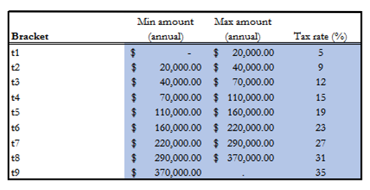
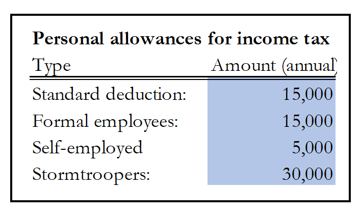

# Problem 1. Applying a Tax Schedule
In the solution below, I started with itemizing the information given in Problem 1. Afterward I processed and transformed the raw data so that key aggregates of interest are ready for subsequent analysis. In the end, I compared the base economy with the new economy in terms of income inequality, government fiscal deficit, etc.

## Research Goal
The Galactic Empire wants to revise its current labor income tax schedule to alleviate a huge deficit and to finance its army. The research goal is to evaluate the impact of the fiscal policy change in the Galactic Empire through a counterfactual policy experiment. <BR>
​    
**Targets to be quantified:**
1. The net total revenues from the entire set of reforms;
2. The overall impact on national Gini coefficient, poverty, and average incomes;
3. Lorenze curve for labor income and total income before and after the reforms.  

## Model Economy

### The base economy
1. The following tax schedule applies to formal labor income: <br>
    
2. Self-employed labor income is taxed at a flat $10\%$ rate. <BR>    
3. The following allowances are available to residents of the Galactic Empire <BR>
     <BR>
    1. The standard deduction applies to all those earning labor income.
    2. Stormtrooper deductions are available to any individuals enlisted in the Galactic Army.
    3. Pension income is taxed in a similar manner to self-employed labor income.

### The new economy
1. Double stormtroopers' current tax allowances.
2. Those under informal employment are assumed to not pay any taxes.
3. $5\%$ of current non-enrolled and not currently employed individuals between the ages of $18$ to $30$ will enlist.
4. The average starting annual salary for new enrollees is $120,000$ credits.
5. Increases the tax rate on self-employed incomes from $10\%$ to $15\%$.
6. The rates on the tax schedule for formal incomes will go up by $2\%$ for all brackets.

## Data

Galactic Empire Household Budget Survey:
1.	You have been given an individual level dataset.
2.	The population of the Galactic Empire is roughly 1.12 billion individuals.
3.	The Empire uses household adult equivalized income for its welfare monitoring.
4.	Poverty lines are included in the data as variables (these are already in monthly adult equivalent terms):
    1.	`lp_ext`: Extreme poverty line
    2.	`lp_mod`: Moderate poverty line
    3.	`lp_vuln`: Vulnearble poverty line
5.	Income is measured using all `inc_*` variables in the dataset. 
    1.	Note that all incomes in the dataset are in gross terms and are monthly.
6.	All results are to be output in well formatted Excel tables and/or Excel graphs, with accompanying well commented Stata do-files.


```stata
drop _all
qui cd "E:\GoogleDrive\GitHub\stata-projects\worldbank-ds-interview"
use "Galactic Empire HBS.dta"
```


```stata
describe
```


    Contains data from Galactic Empire HBS.dta
      obs:       116,902                          
     vars:            35                          13 Dec 2018 09:51
     size:    18,119,810                          
    ---------------------------------------------------------------------------------------------------------------------------------------------------------------------------------------------------------------------------------------------------------------
                  storage   display    value
    variable name   type    format     label      variable label
    ---------------------------------------------------------------------------------------------------------------------------------------------------------------------------------------------------------------------------------------------------------------
    hhid            str32   %32s                  Unique household identifier
    individual_id   byte    %8.0g                 Individual identifier
    partner         float   %57.0g     partner    Who is this person married with?
    hhsize          byte    %8.0g                 HH's number of memebers
    weight          float   %8.0g                 Weight for total family incomes, and percap income
    age             int     %8.0g                 Individual's age
    reltohead       byte    %19.0g     rel        Relationship to household head
    male            float   %9.0g      gend       Male dummy
    lp_ext          float   %9.0g                 Extreme poverty line
    lp_mod          float   %9.0g                 Moderate poverty line
    lp_vuln         float   %9.0g                 Vulnerable poverty line
    aef             float   %9.0g                 Household's adult equivalents
    numkids_hh      float   %9.0g                 Number of children in family household, for eligibility
    allkids_hh      float   %9.0g                 Number of all children in household
    married         float   %9.0g                 Is the individual married
    union           float   %9.0g                 Individual is in a union
    widow           float   %9.0g                 Individual is a widow
    single          float   %9.0g                 Individual is single
    sep_div         float   %9.0g                 Individual is separted/divorced
    stormtrooper    float   %9.0g                 Individual is an Impirial Stormtrooper
    salaried_fw     float   %9.0g                 Formal salaried worker
    salaried_iw     float   %9.0g                 Informal salaried worker
    self_employed   float   %9.0g                 Self employed worker
    inc_nl_1        long    %12.0g                Retirement or pension received - individual, monthly
    inc_nl_2        long    %12.0g                Monthly income due to dismissal - individual, monthly
    inc_nl_3        int     %8.0g                 Unemployment insurance - individual, monthly
    inc_nl_4        long    %8.0g                 Subsidies or social assistance - individual, monthly
    inc_nl_5        long    %12.0g                Rental property income - individual, monthly
    inc_nl_6        long    %12.0g                Side business income (no labor provided) - individual, monthly
    inc_nl_7        long    %12.0g                Investment income, interest income - individual, monthly
    inc_nl_8        long    %12.0g                Scholarship - individual, monthly
    inc_nl_9        long    %12.0g                Alimony - individual, monthly
    inc_l_1         long    %12.0g                Business owner and self-employed without venture partner income from the main oc
    inc_l_2         long    %12.0g                Business owner and self-employed with venture partner income from the main occup
    inc_l_3         long    %12.0g                Wages/salaries, family allowances, extra hours, regular bonuses, vouchers, or ot
    ---------------------------------------------------------------------------------------------------------------------------------------------------------------------------------------------------------------------------------------------------------------
    Sorted by: 


### Data Preprocessing
1. Encoding the long string vairable `hhid` into a numeric variable `nHHid` instead of an encoded variable with a label. [Reference](https://www.stata.com/support/faqs/data-management/encoding-string-variable/)
2. Renaming and/or groupiong some variables for convenience


```stata
egen hid = group(hhid)

rename individual_id id
rename stormtrooper trooper
rename salaried_fw fWorker
rename salaried_iw ifWorker 
rename self_employed sbOwner //small business owner

#delimit ;

local gBasicFeatures
hid
id
weight
age
aef;

local gPovertyLines
lp_ext
lp_mod
lp_vuln;

local gJobStatus
trooper
fWorker
ifWorker
sbOwner;

local gNonLaborIncome
inc_nl_*;

local gLaborIncome
inc_l_*;

#delimit cr
```

We can find missing values in some variables such as trooper (see below).


```stata
%head 5 id age weight `gJobStatus' lp_* inc_* 
```


<div>
<style scoped>
    .dataframe tbody tr th:only-of-type {
        vertical-align: middle;
    }

    .dataframe tbody tr th {
        vertical-align: top;
    }
    
    .dataframe thead th {
        text-align: right;
    }
</style>

<table border="1" class="dataframe">
  <thead>
    <tr style="text-align: right;">
      <th></th>
      <th>id</th>
      <th>age</th>
      <th>weight</th>
      <th>trooper</th>
      <th>fWorker</th>
      <th>ifWorker</th>
      <th>sbOwner</th>
      <th>lp_ext</th>
      <th>lp_mod</th>
      <th>lp_vuln</th>
      <th>inc_nl_1</th>
      <th>inc_nl_2</th>
      <th>inc_nl_3</th>
      <th>inc_nl_4</th>
      <th>inc_nl_5</th>
      <th>inc_nl_6</th>
      <th>inc_nl_7</th>
      <th>inc_nl_8</th>
      <th>inc_nl_9</th>
      <th>inc_l_1</th>
      <th>inc_l_2</th>
      <th>inc_l_3</th>
    </tr>
  </thead>
  <tbody>
    <tr>
      <th>1</th>
      <td>1</td>
      <td>66</td>
      <td>0</td>
      <td>.</td>
      <td>0</td>
      <td>0</td>
      <td>0</td>
      <td>1801.53</td>
      <td>4689.8701</td>
      <td>7034.8052</td>
      <td>.</td>
      <td>0</td>
      <td>0</td>
      <td>0</td>
      <td>0</td>
      <td>0</td>
      <td>0</td>
      <td>0</td>
      <td>0</td>
      <td>.</td>
      <td>.</td>
      <td>.</td>
    </tr>
    <tr>
      <th>2</th>
      <td>1</td>
      <td>73</td>
      <td>3580</td>
      <td>.</td>
      <td>0</td>
      <td>0</td>
      <td>0</td>
      <td>1801.53</td>
      <td>4689.8701</td>
      <td>7034.8052</td>
      <td>18000</td>
      <td>0</td>
      <td>0</td>
      <td>0</td>
      <td>0</td>
      <td>0</td>
      <td>0</td>
      <td>0</td>
      <td>0</td>
      <td>.</td>
      <td>.</td>
      <td>.</td>
    </tr>
    <tr>
      <th>3</th>
      <td>2</td>
      <td>68</td>
      <td>3580</td>
      <td>.</td>
      <td>0</td>
      <td>0</td>
      <td>0</td>
      <td>1801.53</td>
      <td>4689.8701</td>
      <td>7034.8052</td>
      <td>10000</td>
      <td>0</td>
      <td>0</td>
      <td>0</td>
      <td>0</td>
      <td>0</td>
      <td>0</td>
      <td>0</td>
      <td>0</td>
      <td>.</td>
      <td>.</td>
      <td>.</td>
    </tr>
    <tr>
      <th>4</th>
      <td>1</td>
      <td>68</td>
      <td>0</td>
      <td>1</td>
      <td>0</td>
      <td>0</td>
      <td>0</td>
      <td>2070.3301</td>
      <td>5741.6001</td>
      <td>8612.4004</td>
      <td>.</td>
      <td>0</td>
      <td>0</td>
      <td>0</td>
      <td>0</td>
      <td>0</td>
      <td>0</td>
      <td>0</td>
      <td>0</td>
      <td>0</td>
      <td>0</td>
      <td>4500</td>
    </tr>
    <tr>
      <th>5</th>
      <td>1</td>
      <td>44</td>
      <td>18720</td>
      <td>0</td>
      <td>1</td>
      <td>0</td>
      <td>0</td>
      <td>2118.45</td>
      <td>5219.2002</td>
      <td>7828.8003</td>
      <td>0</td>
      <td>0</td>
      <td>0</td>
      <td>0</td>
      <td>0</td>
      <td>0</td>
      <td>0</td>
      <td>0</td>
      <td>0</td>
      <td>0</td>
      <td>0</td>
      <td>11000</td>
    </tr>
  </tbody>
</table>
</div>


```stata
mdesc
```


        Variable    |     Missing          Total     Percent Missing
    ----------------+-----------------------------------------------
               hhid |           0        116,902           0.00
                 id |           0        116,902           0.00
            partner |           0        116,902           0.00
             hhsize |           0        116,902           0.00
             weight |           0        116,902           0.00
                age |           0        116,902           0.00
          reltohead |           0        116,902           0.00
               male |           0        116,902           0.00
             lp_ext |           0        116,902           0.00
             lp_mod |           0        116,902           0.00
            lp_vuln |           0        116,902           0.00
                aef |           0        116,902           0.00
         numkids_hh |           0        116,902           0.00
         allkids_hh |           0        116,902           0.00
            married |           0        116,902           0.00
              union |           0        116,902           0.00
              widow |           0        116,902           0.00
             single |           0        116,902           0.00
            sep_div |           0        116,902           0.00
            trooper |      68,352        116,902          58.47
            fWorker |           0        116,902           0.00
           ifWorker |           0        116,902           0.00
            sbOwner |           0        116,902           0.00
           inc_nl_1 |       1,619        116,902           1.38
           inc_nl_2 |          35        116,902           0.03
           inc_nl_3 |          10        116,902           0.01
           inc_nl_4 |          43        116,902           0.04
           inc_nl_5 |         222        116,902           0.19
           inc_nl_6 |          40        116,902           0.03
           inc_nl_7 |         113        116,902           0.10
           inc_nl_8 |          23        116,902           0.02
           inc_nl_9 |         591        116,902           0.51
            inc_l_1 |      70,305        116,902          60.14
            inc_l_2 |      69,192        116,902          59.19
            inc_l_3 |      72,918        116,902          62.38
                hid |           0        116,902           0.00
    ----------------+-----------------------------------------------


```stata
tabulate weight if weight == 0
```


     Weight for |
          total |
         family |
       incomes, |
     and percap |
         income |      Freq.     Percent        Cum.
    ------------+-----------------------------------
              0 |     24,058      100.00      100.00
    ------------+-----------------------------------
          Total |     24,058      100.00


About $20\%$ $(24,058/116,902)$ of the observations have zero weight.  

I assume that a data point of zero weight is invalid due to unknown reasons. I drop all the members of a houshoeld from the data if the household contains at least one zero individual weight.


```stata
drop if weight <= 0
```

    (24,058 observations deleted)


In addition, some data points have positive weight but missing values in labor income variables (see below).


```stata
%head 5 id age weight `gLaborIncome' `gNonLaborIncome' lp_*
```


<div>
<style scoped>
    .dataframe tbody tr th:only-of-type {
        vertical-align: middle;
    }

    .dataframe tbody tr th {
        vertical-align: top;
    }
    
    .dataframe thead th {
        text-align: right;
    }
</style>
<table border="1" class="dataframe">
  <thead>
    <tr style="text-align: right;">
      <th></th>
      <th>id</th>
      <th>age</th>
      <th>weight</th>
      <th>inc_l_1</th>
      <th>inc_l_2</th>
      <th>inc_l_3</th>
      <th>inc_nl_1</th>
      <th>inc_nl_2</th>
      <th>inc_nl_3</th>
      <th>inc_nl_4</th>
      <th>inc_nl_5</th>
      <th>inc_nl_6</th>
      <th>inc_nl_7</th>
      <th>inc_nl_8</th>
      <th>inc_nl_9</th>
      <th>lp_ext</th>
      <th>lp_mod</th>
      <th>lp_vuln</th>
    </tr>
  </thead>
  <tbody>
    <tr>
      <th>1</th>
      <td>1</td>
      <td>73</td>
      <td>3580</td>
      <td>.</td>
      <td>.</td>
      <td>.</td>
      <td>18000</td>
      <td>0</td>
      <td>0</td>
      <td>0</td>
      <td>0</td>
      <td>0</td>
      <td>0</td>
      <td>0</td>
      <td>0</td>
      <td>1801.53</td>
      <td>4689.8701</td>
      <td>7034.8052</td>
    </tr>
    <tr>
      <th>2</th>
      <td>2</td>
      <td>68</td>
      <td>3580</td>
      <td>.</td>
      <td>.</td>
      <td>.</td>
      <td>10000</td>
      <td>0</td>
      <td>0</td>
      <td>0</td>
      <td>0</td>
      <td>0</td>
      <td>0</td>
      <td>0</td>
      <td>0</td>
      <td>1801.53</td>
      <td>4689.8701</td>
      <td>7034.8052</td>
    </tr>
    <tr>
      <th>3</th>
      <td>1</td>
      <td>44</td>
      <td>18720</td>
      <td>0</td>
      <td>0</td>
      <td>11000</td>
      <td>0</td>
      <td>0</td>
      <td>0</td>
      <td>0</td>
      <td>0</td>
      <td>0</td>
      <td>0</td>
      <td>0</td>
      <td>0</td>
      <td>2118.45</td>
      <td>5219.2002</td>
      <td>7828.8003</td>
    </tr>
    <tr>
      <th>4</th>
      <td>1</td>
      <td>65</td>
      <td>11100</td>
      <td>.</td>
      <td>.</td>
      <td>.</td>
      <td>9000</td>
      <td>0</td>
      <td>0</td>
      <td>0</td>
      <td>0</td>
      <td>0</td>
      <td>0</td>
      <td>0</td>
      <td>0</td>
      <td>1801.53</td>
      <td>4689.8701</td>
      <td>7034.8052</td>
    </tr>
    <tr>
      <th>5</th>
      <td>2</td>
      <td>47</td>
      <td>11100</td>
      <td>.</td>
      <td>.</td>
      <td>.</td>
      <td>6000</td>
      <td>0</td>
      <td>0</td>
      <td>0</td>
      <td>0</td>
      <td>0</td>
      <td>0</td>
      <td>0</td>
      <td>2500</td>
      <td>1801.53</td>
      <td>4689.8701</td>
      <td>7034.8052</td>
    </tr>
  </tbody>
</table>
</div>


We have missing values in all the `income` variables and `trooper` (see below). 


```stata
misstable summarize
```

                                                                   Obs<.
                                                    +------------------------------
                   |                                | Unique
          Variable |     Obs=.     Obs>.     Obs<.  | values        Min         Max
      -------------+--------------------------------+------------------------------
           trooper |    55,635              37,209  |      2          0           1
           inc_l_1 |    55,805              37,039  |    158          0      150000
           inc_l_2 |    55,662              37,182  |     92          0      200000
           inc_l_3 |    55,626              37,218  |    497          0      300000
      -----------------------------------------------------------------------------


I replace missing values with zero before proceeding.


```stata
foreach item of varlist trooper `gLaborIncome' {
    qui replace `item' = 0 if (`item' ==.)
}
```

Now I have filled all the missing values in variables `inc_*` and `trooper` with zeros (see below).


```stata
%head 5 id age weight `gLaborIncome' `gNonLaborIncome' lp_*
```


<div>
<style scoped>
    .dataframe tbody tr th:only-of-type {
        vertical-align: middle;
    }

    .dataframe tbody tr th {
        vertical-align: top;
    }
    
    .dataframe thead th {
        text-align: right;
    }
</style>
<table border="1" class="dataframe">
  <thead>
    <tr style="text-align: right;">
      <th></th>
      <th>id</th>
      <th>age</th>
      <th>weight</th>
      <th>inc_l_1</th>
      <th>inc_l_2</th>
      <th>inc_l_3</th>
      <th>inc_nl_1</th>
      <th>inc_nl_2</th>
      <th>inc_nl_3</th>
      <th>inc_nl_4</th>
      <th>inc_nl_5</th>
      <th>inc_nl_6</th>
      <th>inc_nl_7</th>
      <th>inc_nl_8</th>
      <th>inc_nl_9</th>
      <th>lp_ext</th>
      <th>lp_mod</th>
      <th>lp_vuln</th>
    </tr>
  </thead>
  <tbody>
    <tr>
      <th>1</th>
      <td>1</td>
      <td>73</td>
      <td>3580</td>
      <td>0</td>
      <td>0</td>
      <td>0</td>
      <td>18000</td>
      <td>0</td>
      <td>0</td>
      <td>0</td>
      <td>0</td>
      <td>0</td>
      <td>0</td>
      <td>0</td>
      <td>0</td>
      <td>1801.53</td>
      <td>4689.8701</td>
      <td>7034.8052</td>
    </tr>
    <tr>
      <th>2</th>
      <td>2</td>
      <td>68</td>
      <td>3580</td>
      <td>0</td>
      <td>0</td>
      <td>0</td>
      <td>10000</td>
      <td>0</td>
      <td>0</td>
      <td>0</td>
      <td>0</td>
      <td>0</td>
      <td>0</td>
      <td>0</td>
      <td>0</td>
      <td>1801.53</td>
      <td>4689.8701</td>
      <td>7034.8052</td>
    </tr>
    <tr>
      <th>3</th>
      <td>1</td>
      <td>44</td>
      <td>18720</td>
      <td>0</td>
      <td>0</td>
      <td>11000</td>
      <td>0</td>
      <td>0</td>
      <td>0</td>
      <td>0</td>
      <td>0</td>
      <td>0</td>
      <td>0</td>
      <td>0</td>
      <td>0</td>
      <td>2118.45</td>
      <td>5219.2002</td>
      <td>7828.8003</td>
    </tr>
    <tr>
      <th>4</th>
      <td>1</td>
      <td>65</td>
      <td>11100</td>
      <td>0</td>
      <td>0</td>
      <td>0</td>
      <td>9000</td>
      <td>0</td>
      <td>0</td>
      <td>0</td>
      <td>0</td>
      <td>0</td>
      <td>0</td>
      <td>0</td>
      <td>0</td>
      <td>1801.53</td>
      <td>4689.8701</td>
      <td>7034.8052</td>
    </tr>
    <tr>
      <th>5</th>
      <td>2</td>
      <td>47</td>
      <td>11100</td>
      <td>0</td>
      <td>0</td>
      <td>0</td>
      <td>6000</td>
      <td>0</td>
      <td>0</td>
      <td>0</td>
      <td>0</td>
      <td>0</td>
      <td>0</td>
      <td>0</td>
      <td>2500</td>
      <td>1801.53</td>
      <td>4689.8701</td>
      <td>7034.8052</td>
    </tr>
  </tbody>
</table>
</div>


## Taxable Income

I add up income from labor income and non-labor income respectively. Income from the informal sector is not taxable, so I will take care of this consition later. 


```stata
egen laborIncome = rowtotal(`gLaborIncome')
egen nonLaborIncome = rowtotal(`gNonLaborIncome')
generate totalIncome = laborIncome + nonLaborIncome
```


```stata
%head 5 id age weight `gJobStatus' totalIncome nonLaborIncome laborIncome `gLaborIncome' 
```


<div>
<style scoped>
    .dataframe tbody tr th:only-of-type {
        vertical-align: middle;
    }

    .dataframe tbody tr th {
        vertical-align: top;
    }
    
    .dataframe thead th {
        text-align: right;
    }
</style>
<table border="1" class="dataframe">
  <thead>
    <tr style="text-align: right;">
      <th></th>
      <th>id</th>
      <th>age</th>
      <th>weight</th>
      <th>trooper</th>
      <th>fWorker</th>
      <th>ifWorker</th>
      <th>sbOwner</th>
      <th>totalIncome</th>
      <th>nonLaborIncome</th>
      <th>laborIncome</th>
      <th>inc_l_1</th>
      <th>inc_l_2</th>
      <th>inc_l_3</th>
    </tr>
  </thead>
  <tbody>
    <tr>
      <th>1</th>
      <td>1</td>
      <td>73</td>
      <td>3580</td>
      <td>0</td>
      <td>0</td>
      <td>0</td>
      <td>0</td>
      <td>18000</td>
      <td>18000</td>
      <td>0</td>
      <td>0</td>
      <td>0</td>
      <td>0</td>
    </tr>
    <tr>
      <th>2</th>
      <td>2</td>
      <td>68</td>
      <td>3580</td>
      <td>0</td>
      <td>0</td>
      <td>0</td>
      <td>0</td>
      <td>10000</td>
      <td>10000</td>
      <td>0</td>
      <td>0</td>
      <td>0</td>
      <td>0</td>
    </tr>
    <tr>
      <th>3</th>
      <td>1</td>
      <td>44</td>
      <td>18720</td>
      <td>0</td>
      <td>1</td>
      <td>0</td>
      <td>0</td>
      <td>11000</td>
      <td>0</td>
      <td>11000</td>
      <td>0</td>
      <td>0</td>
      <td>11000</td>
    </tr>
    <tr>
      <th>4</th>
      <td>1</td>
      <td>65</td>
      <td>11100</td>
      <td>0</td>
      <td>0</td>
      <td>0</td>
      <td>0</td>
      <td>9000</td>
      <td>9000</td>
      <td>0</td>
      <td>0</td>
      <td>0</td>
      <td>0</td>
    </tr>
    <tr>
      <th>5</th>
      <td>2</td>
      <td>47</td>
      <td>11100</td>
      <td>0</td>
      <td>0</td>
      <td>0</td>
      <td>0</td>
      <td>8500</td>
      <td>8500</td>
      <td>0</td>
      <td>0</td>
      <td>0</td>
      <td>0</td>
    </tr>
  </tbody>
</table>
</div>


Informl workers account for about $7.5\%$ of the population (see below).


```stata
tabulate ifWorker
```


       Informal |
       salaried |
         worker |      Freq.     Percent        Cum.
    ------------+-----------------------------------
              0 |     85,263       91.83       91.83
              1 |      7,581        8.17      100.00
    ------------+-----------------------------------
          Total |     92,844      100.00


As we can see in the table below, there exist informal workers whose labor income exceeds the standard personal allowance $\$15000$.


```stata
su nonLaborIncome if nonLaborIncome > 15000 & ifWorker == 1
```


        Variable |        Obs        Mean    Std. Dev.       Min        Max
    -------------+---------------------------------------------------------
    nonLaborIn~e |         65    26222.37    13545.22      15200     103000


```stata
%head 5 id age weight `gJobStatus' totalIncome nonLaborIncome laborIncome if nonLaborIncome > 15000 & ifWorker == 1 
```


<div>
<style scoped>
    .dataframe tbody tr th:only-of-type {
        vertical-align: middle;
    }

    .dataframe tbody tr th {
        vertical-align: top;
    }
    
    .dataframe thead th {
        text-align: right;
    }
</style>
<table border="1" class="dataframe">
  <thead>
    <tr style="text-align: right;">
      <th></th>
      <th>id</th>
      <th>age</th>
      <th>weight</th>
      <th>trooper</th>
      <th>fWorker</th>
      <th>ifWorker</th>
      <th>sbOwner</th>
      <th>totalIncome</th>
      <th>nonLaborIncome</th>
      <th>laborIncome</th>
    </tr>
  </thead>
  <tbody>
    <tr>
      <th>1924</th>
      <td>1</td>
      <td>60</td>
      <td>2800</td>
      <td>0</td>
      <td>0</td>
      <td>1</td>
      <td>0</td>
      <td>60000</td>
      <td>20000</td>
      <td>40000</td>
    </tr>
    <tr>
      <th>7644</th>
      <td>2</td>
      <td>74</td>
      <td>56160</td>
      <td>0</td>
      <td>0</td>
      <td>1</td>
      <td>0</td>
      <td>30000</td>
      <td>20000</td>
      <td>10000</td>
    </tr>
    <tr>
      <th>8357</th>
      <td>1</td>
      <td>25</td>
      <td>5680</td>
      <td>0</td>
      <td>0</td>
      <td>1</td>
      <td>0</td>
      <td>35400</td>
      <td>31600</td>
      <td>3800</td>
    </tr>
    <tr>
      <th>9941</th>
      <td>4</td>
      <td>50</td>
      <td>5920</td>
      <td>0</td>
      <td>0</td>
      <td>1</td>
      <td>0</td>
      <td>33000</td>
      <td>18000</td>
      <td>15000</td>
    </tr>
    <tr>
      <th>15010</th>
      <td>1</td>
      <td>67</td>
      <td>6680</td>
      <td>0</td>
      <td>0</td>
      <td>1</td>
      <td>0</td>
      <td>33000</td>
      <td>26000</td>
      <td>7000</td>
    </tr>
  </tbody>
</table>
</div>


As the table above indicates, at least $20$ people under informal employment have `nonLaborIncome` exceeding $\$15000$. However, I will set the tax payment of people from the informal sector to zero in accordance to the instruction of this problem.

## Tax Scheme in the Base Economy

### Persoanl Allowance


```stata
local sbOwnerAllowance    5000 //self-employed, small business owner
local standardAllowance  15000 //standard deduction
local fWorkerAllowance   15000 //formal employee
local trooperAllowance   30000 //stormtroopers  
qui gen allowance = .
qui replace allowance = `sbOwnerAllowance' if sbOwner == 1
qui replace allowance = `fWorkerAllowance' if fWorker == 1
qui replace allowance = `trooperAllowance' if trooper == 1
qui replace allowance = 0 if ifWorker == 1
// pensioners' income is taxed in a similar manner to self-employed labor income.
qui replace allowance = `sbOwnerAllowance' if sbOwner != 1 & fWorker != 1 & trooper != 1 & ifWorker != 1 
```

There is an individual whose job status is calssified into more than one category (see below).


```stata
qui egen count_of_jobstatus = rowtotal(`gJobStatus')
table count_of_jobstatus
```


​    
​    
    ----------------------
    count_of_ |
    jobstatus |      Freq.
    ----------+-----------
            0 |     57,100
            1 |     35,743
            2 |          1
    ----------------------


Who is this person?


```stata
qui ds hhid partner hhsize reltohead male *_hh married union widow single sep_div, not
local keyvarlist = r(varlist)
```


```stata
%head `keyvarlist' if count_of_jobstatus > 1
```


<div>
<style scoped>
    .dataframe tbody tr th:only-of-type {
        vertical-align: middle;
    }

    .dataframe tbody tr th {
        vertical-align: top;
    }
    
    .dataframe thead th {
        text-align: right;
    }
</style>
<table border="1" class="dataframe">
  <thead>
    <tr style="text-align: right;">
      <th></th>
      <th>id</th>
      <th>weight</th>
      <th>age</th>
      <th>lp_ext</th>
      <th>lp_mod</th>
      <th>lp_vuln</th>
      <th>aef</th>
      <th>trooper</th>
      <th>fWorker</th>
      <th>ifWorker</th>
      <th>sbOwner</th>
      <th>inc_nl_1</th>
      <th>inc_nl_2</th>
      <th>inc_nl_3</th>
      <th>inc_nl_4</th>
      <th>inc_nl_5</th>
      <th>inc_nl_6</th>
      <th>inc_nl_7</th>
      <th>inc_nl_8</th>
      <th>inc_nl_9</th>
      <th>inc_l_1</th>
      <th>inc_l_2</th>
      <th>inc_l_3</th>
      <th>hid</th>
      <th>laborIncome</th>
      <th>nonLaborIncome</th>
      <th>totalIncome</th>
      <th>allowance</th>
      <th>count_of_jobstatus</th>
    </tr>
  </thead>
  <tbody>
    <tr>
      <th>75803</th>
      <td>1</td>
      <td>65340</td>
      <td>50</td>
      <td>2118.45</td>
      <td>5219.2002</td>
      <td>7828.8003</td>
      <td>2.8199999</td>
      <td>1</td>
      <td>0</td>
      <td>0</td>
      <td>1</td>
      <td>0</td>
      <td>0</td>
      <td>0</td>
      <td>0</td>
      <td>0</td>
      <td>0</td>
      <td>0</td>
      <td>0</td>
      <td>0</td>
      <td>2500</td>
      <td>0</td>
      <td>0</td>
      <td>30518</td>
      <td>2500</td>
      <td>0</td>
      <td>2500</td>
      <td>30000</td>
      <td>2</td>
    </tr>
  </tbody>
</table>
</div>


It turns out that this individual is enlisted in the troop and also a business owner. Since the presonal allowane is higher for people in the troop than in the entrepreneur category, the person should choose former for calculating tax payment. I have taken this abnormal data point above.


```stata
// taxableIncome is non-negative.
generate taxableIncome = 0
replace taxableIncome = max(0, totalIncome - allowance)
```


​    
    (33,678 real changes made)


```stata
%head 5 id age weight allowance totalIncome taxableIncome `gJobStatus' 
```


<div>
<style scoped>
    .dataframe tbody tr th:only-of-type {
        vertical-align: middle;
    }

    .dataframe tbody tr th {
        vertical-align: top;
    }
    
    .dataframe thead th {
        text-align: right;
    }
</style>
<table border="1" class="dataframe">
  <thead>
    <tr style="text-align: right;">
      <th></th>
      <th>id</th>
      <th>age</th>
      <th>weight</th>
      <th>allowance</th>
      <th>totalIncome</th>
      <th>taxableIncome</th>
      <th>trooper</th>
      <th>fWorker</th>
      <th>ifWorker</th>
      <th>sbOwner</th>
    </tr>
  </thead>
  <tbody>
    <tr>
      <th>1</th>
      <td>1</td>
      <td>73</td>
      <td>3580</td>
      <td>5000</td>
      <td>18000</td>
      <td>13000</td>
      <td>0</td>
      <td>0</td>
      <td>0</td>
      <td>0</td>
    </tr>
    <tr>
      <th>2</th>
      <td>2</td>
      <td>68</td>
      <td>3580</td>
      <td>5000</td>
      <td>10000</td>
      <td>5000</td>
      <td>0</td>
      <td>0</td>
      <td>0</td>
      <td>0</td>
    </tr>
    <tr>
      <th>3</th>
      <td>1</td>
      <td>44</td>
      <td>18720</td>
      <td>15000</td>
      <td>11000</td>
      <td>0</td>
      <td>0</td>
      <td>1</td>
      <td>0</td>
      <td>0</td>
    </tr>
    <tr>
      <th>4</th>
      <td>1</td>
      <td>65</td>
      <td>11100</td>
      <td>5000</td>
      <td>9000</td>
      <td>4000</td>
      <td>0</td>
      <td>0</td>
      <td>0</td>
      <td>0</td>
    </tr>
    <tr>
      <th>5</th>
      <td>2</td>
      <td>47</td>
      <td>11100</td>
      <td>5000</td>
      <td>8500</td>
      <td>3500</td>
      <td>0</td>
      <td>0</td>
      <td>0</td>
      <td>0</td>
    </tr>
  </tbody>
</table>
</div>


### Prograssive Tax Scheme


```stata
local t1UpperBound  20000
local t2UpperBound  40000
local t3UpperBound  70000
local t4UpperBound 110000
local t5UpperBound 160000
local t6UpperBound 220000
local t7UpperBound 290000
local t8UpperBound 370000

local t1TaxRate  5 
local t2TaxRate  9
local t3TaxRate 12
local t4TaxRate 15
local t5TaxRate 19
local t6TaxRate 23
local t7TaxRate 27
local t8TaxRate 31
local t9TaxRate 35

local t1DeltaTaxRate = `t1TaxRate'
local t2DeltaTaxRate = `t2TaxRate' - `t1TaxRate' 
local t3DeltaTaxRate = `t3TaxRate' - `t2TaxRate'
local t4DeltaTaxRate = `t4TaxRate' - `t3TaxRate'
local t5DeltaTaxRate = `t5TaxRate' - `t4TaxRate'
local t6DeltaTaxRate = `t6TaxRate' - `t5TaxRate'
local t7DeltaTaxRate = `t7TaxRate' - `t6TaxRate'
local t8DeltaTaxRate = `t8TaxRate' - `t7TaxRate'
local t9DeltaTaxRate = `t9TaxRate' - `t8TaxRate'

local ratelist = "`t1DeltaTaxRate' `t2DeltaTaxRate' `t3DeltaTaxRate' `t4DeltaTaxRate' `t5DeltaTaxRate' `t6DeltaTaxRate' `t7DeltaTaxRate' `t8DeltaTaxRate' `t9DeltaTaxRate'"
local breaklist = "0 `t1UpperBound' `t2UpperBound' `t3UpperBound' `t4UpperBound' `t5UpperBound' `t6UpperBound' `t7UpperBound' `t8UpperBound'"
```

Apply the formal labor income tax schedule to everyone first:


```stata
local numtimes = wordcount("`ratelist'")
gen taxPayment = 0
forval i = 1/`numtimes' {
    local bound = word("`breaklist'", `i')
    local rate = word("`ratelist'", `i')
    qui replace taxPayment = taxPayment + 0.01 * `rate' * (taxableIncome - `bound') if (taxableIncome > `bound')
}
```


```stata
%head 5 id age weight allowance totalIncome taxableIncome `gJobStatus' taxPayment
```


<div>
<style scoped>
    .dataframe tbody tr th:only-of-type {
        vertical-align: middle;
    }

    .dataframe tbody tr th {
        vertical-align: top;
    }
    
    .dataframe thead th {
        text-align: right;
    }
</style>
<table border="1" class="dataframe">
  <thead>
    <tr style="text-align: right;">
      <th></th>
      <th>id</th>
      <th>age</th>
      <th>weight</th>
      <th>allowance</th>
      <th>totalIncome</th>
      <th>taxableIncome</th>
      <th>trooper</th>
      <th>fWorker</th>
      <th>ifWorker</th>
      <th>sbOwner</th>
      <th>taxPayment</th>
    </tr>
  </thead>
  <tbody>
    <tr>
      <th>1</th>
      <td>1</td>
      <td>73</td>
      <td>3580</td>
      <td>5000</td>
      <td>18000</td>
      <td>13000</td>
      <td>0</td>
      <td>0</td>
      <td>0</td>
      <td>0</td>
      <td>650</td>
    </tr>
    <tr>
      <th>2</th>
      <td>2</td>
      <td>68</td>
      <td>3580</td>
      <td>5000</td>
      <td>10000</td>
      <td>5000</td>
      <td>0</td>
      <td>0</td>
      <td>0</td>
      <td>0</td>
      <td>250</td>
    </tr>
    <tr>
      <th>3</th>
      <td>1</td>
      <td>44</td>
      <td>18720</td>
      <td>15000</td>
      <td>11000</td>
      <td>0</td>
      <td>0</td>
      <td>1</td>
      <td>0</td>
      <td>0</td>
      <td>0</td>
    </tr>
    <tr>
      <th>4</th>
      <td>1</td>
      <td>65</td>
      <td>11100</td>
      <td>5000</td>
      <td>9000</td>
      <td>4000</td>
      <td>0</td>
      <td>0</td>
      <td>0</td>
      <td>0</td>
      <td>200</td>
    </tr>
    <tr>
      <th>5</th>
      <td>2</td>
      <td>47</td>
      <td>11100</td>
      <td>5000</td>
      <td>8500</td>
      <td>3500</td>
      <td>0</td>
      <td>0</td>
      <td>0</td>
      <td>0</td>
      <td>175</td>
    </tr>
  </tbody>
</table>
</div>


Take care of taxes imposed on people other than formal worker:


```stata
local sbOwnerFlatRate   10
local pensionerFlatRate 10
qui replace taxPayment = taxableIncome * 0.01 * `sbOwnerFlatRate' if sbOwner == 1 & trooper != 1 // business owner
qui replace taxPayment = taxableIncome * 0.01 * `pensionerFlatRate' if sbOwner == 0 & trooper == 0 & fWorker == 0 & ifWorker == 0 // pensioner
qui replace taxPayment = 0 if ifWorker == 1 // informal sector wage earner
```


```stata
%head 5 id age weight allowance totalIncome taxableIncome `gJobStatus' taxPayment
```


<div>
<style scoped>
    .dataframe tbody tr th:only-of-type {
        vertical-align: middle;
    }

    .dataframe tbody tr th {
        vertical-align: top;
    }
    
    .dataframe thead th {
        text-align: right;
    }
</style>
<table border="1" class="dataframe">
  <thead>
    <tr style="text-align: right;">
      <th></th>
      <th>id</th>
      <th>age</th>
      <th>weight</th>
      <th>allowance</th>
      <th>totalIncome</th>
      <th>taxableIncome</th>
      <th>trooper</th>
      <th>fWorker</th>
      <th>ifWorker</th>
      <th>sbOwner</th>
      <th>taxPayment</th>
    </tr>
  </thead>
  <tbody>
    <tr>
      <th>1</th>
      <td>1</td>
      <td>73</td>
      <td>3580</td>
      <td>5000</td>
      <td>18000</td>
      <td>13000</td>
      <td>0</td>
      <td>0</td>
      <td>0</td>
      <td>0</td>
      <td>1300</td>
    </tr>
    <tr>
      <th>2</th>
      <td>2</td>
      <td>68</td>
      <td>3580</td>
      <td>5000</td>
      <td>10000</td>
      <td>5000</td>
      <td>0</td>
      <td>0</td>
      <td>0</td>
      <td>0</td>
      <td>500</td>
    </tr>
    <tr>
      <th>3</th>
      <td>1</td>
      <td>44</td>
      <td>18720</td>
      <td>15000</td>
      <td>11000</td>
      <td>0</td>
      <td>0</td>
      <td>1</td>
      <td>0</td>
      <td>0</td>
      <td>0</td>
    </tr>
    <tr>
      <th>4</th>
      <td>1</td>
      <td>65</td>
      <td>11100</td>
      <td>5000</td>
      <td>9000</td>
      <td>4000</td>
      <td>0</td>
      <td>0</td>
      <td>0</td>
      <td>0</td>
      <td>400</td>
    </tr>
    <tr>
      <th>5</th>
      <td>2</td>
      <td>47</td>
      <td>11100</td>
      <td>5000</td>
      <td>8500</td>
      <td>3500</td>
      <td>0</td>
      <td>0</td>
      <td>0</td>
      <td>0</td>
      <td>350</td>
    </tr>
  </tbody>
</table>
</div>


Disposable income is the amount of total income net of tax payment:


```stata
gen disposableIncome = totalIncome - taxPayment
```


```stata
%head 5 `gJobStatus' disposableIncome allowance totalIncome taxableIncome taxPayment 
```


<div>
<style scoped>
    .dataframe tbody tr th:only-of-type {
        vertical-align: middle;
    }

    .dataframe tbody tr th {
        vertical-align: top;
    }
    
    .dataframe thead th {
        text-align: right;
    }
</style>
<table border="1" class="dataframe">
  <thead>
    <tr style="text-align: right;">
      <th></th>
      <th>trooper</th>
      <th>fWorker</th>
      <th>ifWorker</th>
      <th>sbOwner</th>
      <th>disposableIncome</th>
      <th>allowance</th>
      <th>totalIncome</th>
      <th>taxableIncome</th>
      <th>taxPayment</th>
    </tr>
  </thead>
  <tbody>
    <tr>
      <th>1</th>
      <td>0</td>
      <td>0</td>
      <td>0</td>
      <td>0</td>
      <td>16700</td>
      <td>5000</td>
      <td>18000</td>
      <td>13000</td>
      <td>1300</td>
    </tr>
    <tr>
      <th>2</th>
      <td>0</td>
      <td>0</td>
      <td>0</td>
      <td>0</td>
      <td>9500</td>
      <td>5000</td>
      <td>10000</td>
      <td>5000</td>
      <td>500</td>
    </tr>
    <tr>
      <th>3</th>
      <td>0</td>
      <td>1</td>
      <td>0</td>
      <td>0</td>
      <td>11000</td>
      <td>15000</td>
      <td>11000</td>
      <td>0</td>
      <td>0</td>
    </tr>
    <tr>
      <th>4</th>
      <td>0</td>
      <td>0</td>
      <td>0</td>
      <td>0</td>
      <td>8600</td>
      <td>5000</td>
      <td>9000</td>
      <td>4000</td>
      <td>400</td>
    </tr>
    <tr>
      <th>5</th>
      <td>0</td>
      <td>0</td>
      <td>0</td>
      <td>0</td>
      <td>8150</td>
      <td>5000</td>
      <td>8500</td>
      <td>3500</td>
      <td>350</td>
    </tr>
  </tbody>
</table>
</div>


### Poverty Lines


```stata
generate isPoor_ext = 0 
generate isPoor_mod = 0 
generate isPoor_vul = 0 
qui replace isPoor_ext = 1 if disposableIncome < lp_ext
qui replace isPoor_mod = 1 if disposableIncome < lp_mod
qui replace isPoor_vul = 1 if disposableIncome < lp_vul
local gIsPoor isPoor_*
```


```stata
%head 10 id age disposableIncome `gPovertyLines' `gIsPoor'
```


<div>
<style scoped>
    .dataframe tbody tr th:only-of-type {
        vertical-align: middle;
    }

    .dataframe tbody tr th {
        vertical-align: top;
    }
    
    .dataframe thead th {
        text-align: right;
    }
</style>
<table border="1" class="dataframe">
  <thead>
    <tr style="text-align: right;">
      <th></th>
      <th>id</th>
      <th>age</th>
      <th>disposableIncome</th>
      <th>lp_ext</th>
      <th>lp_mod</th>
      <th>lp_vuln</th>
      <th>isPoor_ext</th>
      <th>isPoor_mod</th>
      <th>isPoor_vul</th>
    </tr>
  </thead>
  <tbody>
    <tr>
      <th>1</th>
      <td>1</td>
      <td>73</td>
      <td>16700</td>
      <td>1801.53</td>
      <td>4689.8701</td>
      <td>7034.8052</td>
      <td>0</td>
      <td>0</td>
      <td>0</td>
    </tr>
    <tr>
      <th>2</th>
      <td>2</td>
      <td>68</td>
      <td>9500</td>
      <td>1801.53</td>
      <td>4689.8701</td>
      <td>7034.8052</td>
      <td>0</td>
      <td>0</td>
      <td>0</td>
    </tr>
    <tr>
      <th>3</th>
      <td>1</td>
      <td>44</td>
      <td>11000</td>
      <td>2118.45</td>
      <td>5219.2002</td>
      <td>7828.8003</td>
      <td>0</td>
      <td>0</td>
      <td>0</td>
    </tr>
    <tr>
      <th>4</th>
      <td>1</td>
      <td>65</td>
      <td>8600</td>
      <td>1801.53</td>
      <td>4689.8701</td>
      <td>7034.8052</td>
      <td>0</td>
      <td>0</td>
      <td>0</td>
    </tr>
    <tr>
      <th>5</th>
      <td>2</td>
      <td>47</td>
      <td>8150</td>
      <td>1801.53</td>
      <td>4689.8701</td>
      <td>7034.8052</td>
      <td>0</td>
      <td>0</td>
      <td>0</td>
    </tr>
    <tr>
      <th>6</th>
      <td>3</td>
      <td>18</td>
      <td>1720</td>
      <td>1801.53</td>
      <td>4689.8701</td>
      <td>7034.8052</td>
      <td>1</td>
      <td>1</td>
      <td>1</td>
    </tr>
    <tr>
      <th>7</th>
      <td>4</td>
      <td>17</td>
      <td>0</td>
      <td>1801.53</td>
      <td>4689.8701</td>
      <td>7034.8052</td>
      <td>1</td>
      <td>1</td>
      <td>1</td>
    </tr>
    <tr>
      <th>8</th>
      <td>1</td>
      <td>53</td>
      <td>16700</td>
      <td>1893.92</td>
      <td>4975.4199</td>
      <td>7463.1299</td>
      <td>0</td>
      <td>0</td>
      <td>0</td>
    </tr>
    <tr>
      <th>9</th>
      <td>2</td>
      <td>52</td>
      <td>16700</td>
      <td>1893.92</td>
      <td>4975.4199</td>
      <td>7463.1299</td>
      <td>0</td>
      <td>0</td>
      <td>0</td>
    </tr>
    <tr>
      <th>10</th>
      <td>1</td>
      <td>36</td>
      <td>9500</td>
      <td>2018.67</td>
      <td>4932.1699</td>
      <td>7398.2549</td>
      <td>0</td>
      <td>0</td>
      <td>0</td>
    </tr>
  </tbody>
</table>
</div>


### Some Interesting Observations

There exist young entrepreneurs or young wage earners who are relatively rich compared to their peers. However, following the insturction of Question 1, I treat these young entrepreneurs and young wage earners the same as their parents when computing individual tax payment (see below).


```stata
%head 55 id age weight disposableIncome if age < 18 & totalIncome > 20000
```


<div>
<style scoped>
    .dataframe tbody tr th:only-of-type {
        vertical-align: middle;
    }

    .dataframe tbody tr th {
        vertical-align: top;
    }
    
    .dataframe thead th {
        text-align: right;
    }
</style>
<table border="1" class="dataframe">
  <thead>
    <tr style="text-align: right;">
      <th></th>
      <th>id</th>
      <th>age</th>
      <th>weight</th>
      <th>disposableIncome</th>
    </tr>
  </thead>
  <tbody>
    <tr>
      <th>2066</th>
      <td>3</td>
      <td>15</td>
      <td>3420</td>
      <td>23550</td>
    </tr>
    <tr>
      <th>59885</th>
      <td>3</td>
      <td>17</td>
      <td>2920</td>
      <td>19400</td>
    </tr>
  </tbody>
</table>
</div>


People 18 years old or younger who receive no income account for a non-trivial fraction of the population (see below).


```stata
tabulate age if age < 10 & totalIncome == 0
```


    Individual' |
          s age |      Freq.     Percent        Cum.
    ------------+-----------------------------------
              0 |      1,080        7.82        7.82
              1 |      1,268        9.18       17.00
              2 |      1,415       10.24       27.24
              3 |      1,405       10.17       37.41
              4 |      1,438       10.41       47.82
              5 |      1,441       10.43       58.25
              6 |      1,426       10.32       68.57
              7 |      1,399       10.13       78.70
              8 |      1,449       10.49       89.19
              9 |      1,494       10.81      100.00
    ------------+-----------------------------------
          Total |     13,815      100.00


## Macro Statistics of the Base Economy

### Empire Expenditure and Tax Revenue


```stata
// Expenditure on Troop
generate empireExpense1 = 0
qui replace empireExpense1 = inc_l_3 * weight if trooper == 1 
```


```stata
// Tax Revenue 
generate taxRevenue1 = 0
qui replace taxRevenue1 = taxPayment * weight
```


```stata
// Net Total Revenues
qui egen totalTaxRevenue1 = sum(taxRevenue1) 
qui egen totalEmpireExpense1 = sum(empireExpense1)
qui egen netTotalRevenue1 = sum(taxRevenue1 - empireExpense1)
```


```stata
%head 1 netTotalRevenue1 totalTaxRevenue1 totalEmpireExpense1
```


<div>
<style scoped>
    .dataframe tbody tr th:only-of-type {
        vertical-align: middle;
    }

    .dataframe tbody tr th {
        vertical-align: top;
    }
    
    .dataframe thead th {
        text-align: right;
    }
</style>
<table border="1" class="dataframe">
  <thead>
    <tr style="text-align: right;">
      <th></th>
      <th>netTotalRevenue1</th>
      <th>totalTaxRevenue1</th>
      <th>totalEmpireExpense1</th>
    </tr>
  </thead>
  <tbody>
    <tr>
      <th>1</th>
      <td>-1288721268736</td>
      <td>255534088192</td>
      <td>1544255307776</td>
    </tr>
  </tbody>
</table>
</div>


### National Gini Coefficient


```stata
qui ineqdeco disposableIncome [fw=weight]
di "National Gini Coefficient: "
di "Gini 1: " r(gini)
```


​    
    National Gini Coefficient: 
    
    Gini 1: .39747555


### Poverty


```stata
proportion isPoor_ext [fw=weight]
matrix list r(table)
matrix b_ext = r(table)
local sharePoor_ext1 b_ext[1,2]
```


​    
    Proportion estimation             Number of obs   = 1103738460
    
    --------------------------------------------------------------
                 |                                   Logit
                 | Proportion   Std. Err.     [95% Conf. Interval]
    -------------+------------------------------------------------
    isPoor_ext   |
               0 |    .564767   .0000149      .5647378    .5647962
               1 |    .435233   .0000149      .4352038    .4352622
    --------------------------------------------------------------


​    
    r(table)[9,2]
             isPoor_ext:  isPoor_ext:
                      0            1
         b      .564767      .435233
        se    .00001492    .00001492
         t    37844.854    29164.823
    pvalue            0            0
        ll    .56473775    .43520375
        ul    .56479625    .43526225
        df    1.104e+09    1.104e+09
      crit     1.959964     1.959964
     eform            0            0


​    
​    


```stata
proportion isPoor_mod [fw=weight]
matrix list r(table)
matrix b_mod = r(table)
local sharePoor_mod1 b_mod[1,2]
```


​    
    Proportion estimation             Number of obs   = 1103738460
    
    --------------------------------------------------------------
                 |                                   Logit
                 | Proportion   Std. Err.     [95% Conf. Interval]
    -------------+------------------------------------------------
    isPoor_mod   |
               0 |   .5037526    .000015      .5037231    .5037821
               1 |   .4962474    .000015      .4962179    .4962769
    --------------------------------------------------------------


​    
    r(table)[9,2]
             isPoor_mod:  isPoor_mod:
                      0            1
         b    .50375256    .49624744
        se    .00001505    .00001505
         t    33472.842    32974.149
    pvalue            0            0
        ll    .50372307    .49621794
        ul    .50378206    .49627693
        df    1.104e+09    1.104e+09
      crit     1.959964     1.959964
     eform            0            0


​    
​    


```stata
proportion isPoor_vul [fw=weight]
matrix list r(table)
matrix b_vul = r(table)
local sharePoor_vul1 b_vul[1,2]
```


​    
    Proportion estimation             Number of obs   = 1103738460
    
    --------------------------------------------------------------
                 |                                   Logit
                 | Proportion   Std. Err.     [95% Conf. Interval]
    -------------+------------------------------------------------
    isPoor_vul   |
               0 |   .3829648   .0000146      .3829362    .3829935
               1 |   .6170352   .0000146      .6170065    .6170638
    --------------------------------------------------------------


​    
    r(table)[9,2]
             isPoor_vul:  isPoor_vul:
                      0            1
         b    .38296484    .61703516
        se    .00001463    .00001463
         t    26173.246    42170.485
    pvalue            0            0
        ll    .38293616    .61700648
        ul    .38299352    .61706384
        df    1.104e+09    1.104e+09
      crit     1.959964     1.959964
     eform            0            0


​    
​    


```stata
di "PoorExt 1: " `sharePoor_ext1' 
di "PoorMod 1: " `sharePoor_mod1' 
di "PoorVul 1: " `sharePoor_vul1'
```


    PoorExt 1: .435233
    
    PoorMod 1: .49624744
    
    PoorVul 1: .61703516


### Average Incomes


```stata
su totalIncome [fw=weight]
local totInc1 = r(mean)
```


​    
        Variable |        Obs        Mean    Std. Dev.       Min        Max
    -------------+---------------------------------------------------------
     totalIncome | 1103738460    7932.404    11689.21          0     800000


​    


```stata
su disposableIncome [fw=weight]
local disInc1 = r(mean)
```


​    
        Variable |        Obs        Mean    Std. Dev.       Min        Max
    -------------+---------------------------------------------------------
    disposable~e | 1103738460    7700.887    11044.13          0     720500


​    


```stata
di "totoal income 1:     " `totInc1'
di "disposable income 1: " `disInc1'
```


    totoal income 1:     7932.404
    
    disposable income 1: 7700.8871


### Lorenz Curves

Overlaying Lorenz Curves. [Reference](http://repec.sowi.unibe.ch/files/wp15/jann-2016-lorenz.pdf#page=25)


```stata
graph display
qui lorenz estimate totalIncome disposableIncome, graph(overlay aspectratio(1) xlabels(, grid) ciopts(recast(rline)) lp(dash))
```

## Tax Scheme in the Counterfactual Economy

1. Double stormtroopers' current tax allowances.
3. $5\%$ of current non-enrolled and not currently employed individuals between the ages of $18$ to $30$ will enlist.
4. The average starting annual salary for new enrollees is $120,000$ credits.
5. Increases the tax rate on self-employed incomes from $10\%$ to $15\%$.
6. The rates on the tax schedule for formal incomes will go up by $2\%$ for all brackets.


```stata
// New environment setting based on bullet item numbers 1, 3, 4, and 5
local trooperAllowance = `trooperAllowance' * 2
local sbOwnerFlatRate   15
local pensionerFlatRate 15
local t1TaxRate = `t1TaxRate' + 2 
local t2TaxRate = `t2TaxRate' + 2
local t3TaxRate = `t3TaxRate' + 2
local t4TaxRate = `t4TaxRate' + 2
local t5TaxRate = `t5TaxRate' + 2
local t6TaxRate = `t6TaxRate' + 2
local t7TaxRate = `t7TaxRate' + 2
local t8TaxRate = `t8TaxRate' + 2
local t9TaxRate = `t9TaxRate' + 2
local newEnlistCredit 120000
```


```stata
local numtimes = wordcount("`ratelist'")

qui replace taxPayment = 0
forval i = 1/`numtimes' {
    local bound = word("`breaklist'", `i')
    local rate = word("`ratelist'", `i')
    qui replace taxPayment = taxPayment + 0.01 * `rate' * (taxableIncome - `bound') if (taxableIncome > `bound')
}
qui replace taxPayment = taxableIncome * 0.01 * `sbOwnerFlatRate' if sbOwner == 1 & trooper != 1 // business owner
qui replace taxPayment = taxableIncome * 0.01 * `pensionerFlatRate' if sbOwner == 0 & trooper == 0 & fWorker == 0 & ifWorker == 0 // pensioner
qui replace taxPayment = 0 if ifWorker == 1 // informal sector wage earner

qui replace disposableIncome = 0
qui replace disposableIncome = totalIncome - taxPayment
```


```stata
// allowance needs modification
qui replace allowance = `trooperAllowance' if trooper == 1
```


```stata
// 5% newly enlisted 18-30 and 120,000 credits
qui gen turnTrooperLaborIncome = 0
qui replace turnTrooperLaborIncome = `newEnlistCredit' if trooper != 1 & fWorker != 1 & ifWorker != 1 & sbOwner != 1 & age <= 30 & age >= 18

qui gen turnTrooperTotalIncome = 0
qui replace turnTrooperTotalIncome = turnTrooperLaborIncome + nonLaborIncome if trooper != 1 & fWorker != 1 & ifWorker != 1 & sbOwner != 1 & age <= 30 & age >= 18

qui gen turnTrooperAllowance = 0
qui replace turnTrooperAllowance = `trooperAllowance' if trooper != 1 & fWorker != 1 & ifWorker != 1 & sbOwner != 1 & age <= 30 & age >= 18

qui gen turnTrooperTaxableIncome = 0
qui replace turnTrooperTaxableIncome = nonLaborIncome + turnTrooperLaborIncome - turnTrooperAllowance if trooper != 1 & fWorker != 1 & ifWorker != 1 & sbOwner != 1 & age <= 30 & age >= 18 
```

Apply the new tax scheme to newly enlisted trooper:


```stata
local numtimes = wordcount("`ratelist'")
generate turnTrooperTaxPayment = 0
forval i = 1/`numtimes' {
    local bound = word("`breaklist'", `i')
    local rate = word("`ratelist'", `i')
    qui replace turnTrooperTaxPayment = turnTrooperTaxPayment + 0.01 * `rate' * (turnTrooperTaxableIncome - `bound') if (turnTrooperTaxableIncome > `bound') &  trooper != 1 & fWorker != 1 & ifWorker != 1 & sbOwner != 1 & age <= 30 & age >= 18
}
```


```stata
generate turnTrooperDisposableIncome = 0
qui replace turnTrooperDisposableIncome = nonLaborIncome + turnTrooperLaborIncome - turnTrooperTaxPayment if trooper != 1 & fWorker != 1 & ifWorker != 1 & sbOwner != 1 & age <= 30 & age >= 18
```


```stata
%head 5 id age weight totalIncome allowance taxableIncome taxPayment disposableIncome turnTrooperTotalIncome turnTrooperTaxableIncome turnTrooperTaxPayment turnTrooperDisposableIncome  if trooper != 1 & fWorker != 1 & ifWorker != 1 & sbOwner != 1 & age <= 30 & age >= 18
```


<div>
<style scoped>
    .dataframe tbody tr th:only-of-type {
        vertical-align: middle;
    }

    .dataframe tbody tr th {
        vertical-align: top;
    }
    
    .dataframe thead th {
        text-align: right;
    }
</style>
<table border="1" class="dataframe">
  <thead>
    <tr style="text-align: right;">
      <th></th>
      <th>id</th>
      <th>age</th>
      <th>weight</th>
      <th>totalIncome</th>
      <th>allowance</th>
      <th>taxableIncome</th>
      <th>taxPayment</th>
      <th>disposableIncome</th>
      <th>turnTrooperTotalIncome</th>
      <th>turnTrooperTaxableIncome</th>
      <th>turnTrooperTaxPayment</th>
      <th>turnTrooperDisposableIncome</th>
    </tr>
  </thead>
  <tbody>
    <tr>
      <th>6</th>
      <td>3</td>
      <td>18</td>
      <td>11100</td>
      <td>1720</td>
      <td>5000</td>
      <td>0</td>
      <td>0</td>
      <td>1720</td>
      <td>121720</td>
      <td>61720</td>
      <td>5406.3999</td>
      <td>116313.6</td>
    </tr>
    <tr>
      <th>23</th>
      <td>5</td>
      <td>24</td>
      <td>12740</td>
      <td>1600</td>
      <td>5000</td>
      <td>0</td>
      <td>0</td>
      <td>1600</td>
      <td>121600</td>
      <td>61600</td>
      <td>5392</td>
      <td>116208</td>
    </tr>
    <tr>
      <th>36</th>
      <td>2</td>
      <td>25</td>
      <td>2560</td>
      <td>900</td>
      <td>5000</td>
      <td>0</td>
      <td>0</td>
      <td>900</td>
      <td>120900</td>
      <td>60900</td>
      <td>5308</td>
      <td>115592</td>
    </tr>
    <tr>
      <th>40</th>
      <td>2</td>
      <td>20</td>
      <td>3380</td>
      <td>0</td>
      <td>5000</td>
      <td>0</td>
      <td>0</td>
      <td>0</td>
      <td>120000</td>
      <td>60000</td>
      <td>5200</td>
      <td>114800</td>
    </tr>
    <tr>
      <th>70</th>
      <td>3</td>
      <td>20</td>
      <td>2160</td>
      <td>0</td>
      <td>5000</td>
      <td>0</td>
      <td>0</td>
      <td>0</td>
      <td>120000</td>
      <td>60000</td>
      <td>5200</td>
      <td>114800</td>
    </tr>
  </tbody>
</table>
</div>


## Law of Large Number

To simulate the condition that $5\%$ of current non-enrolled and not currently employed individuals of ages 18-30 will enlist under the new tax scheme, two scenarios **for each observation in this cohort** is deployed: One is the scenario where people in this cohort will reamin out of troop and unemployed under the new tax system; the other is the scenario where people of this group will be enlisted due to the introduction of double allowance. I set the probability of the stay-put scenario to be $95\%$, and the probability of the alternative scenario to be $5\%$. <BR>

By the Law of Large Number, I can evaluate the average of the statatiscs of interest based on taking expectation without resorting to any simulation. 


```stata
local probStayPut 0.95
local probTurnTrooper = 1 - `probStayPut'
```


```stata
qui generate totalIncome2 = totalIncome
qui generate taxPayment2 = taxPayment
qui generate disposableIncome2 = disposableIncome

qui replace totalIncome2 = `probStayPut' * totalIncome2 + `probTurnTrooper' * turnTrooperTotalIncome if trooper != 1 & fWorker != 1 & ifWorker != 1 & sbOwner != 1 & age <= 30 & age >= 18
qui replace taxPayment2 = `probStayPut' * taxPayment2 + `probTurnTrooper' * turnTrooperTaxPayment if trooper != 1 & fWorker != 1 & ifWorker != 1 & sbOwner != 1 & age <= 30 & age >= 18
qui replace disposableIncome2 = `probStayPut' * disposableIncome2 + `probTurnTrooper' * turnTrooperDisposableIncome if trooper != 1 & fWorker != 1 & ifWorker != 1 & sbOwner != 1 & age <= 30 & age >= 18
```


```stata
// Expenditure on Troop
generate empireExpense2 = 0
qui replace empireExpense2 = inc_l_3 * weight if trooper == 1 // enlisted before the fiscal policy change
qui replace empireExpense2 = (`probTurnTrooper' * `newEnlistCredit' + `probStayPut' * 0) * weight if trooper != 1 & fWorker != 1 & ifWorker != 1 & sbOwner != 1 & age <= 30 & age >= 18
```

## Macro Statistics of the New Economy


```stata
// Tax Revenue 
generate taxRevenue2 = 0
qui replace taxRevenue2 = taxPayment2 * weight
```


```stata
// Net Total Revenues
qui egen totalTaxRevenue2 = sum(taxRevenue2) 
qui egen totalEmpireExpense2 = sum(empireExpense2)
qui egen netTotalRevenue2 = sum(taxRevenue2 - empireExpense2)
```


```stata
%head 1 netTotalRevenue1 totalTaxRevenue1 totalEmpireExpense1 netTotalRevenue2 totalTaxRevenue2 totalEmpireExpense2
```


<div>
<style scoped>
    .dataframe tbody tr th:only-of-type {
        vertical-align: middle;
    }

    .dataframe tbody tr th {
        vertical-align: top;
    }
    
    .dataframe thead th {
        text-align: right;
    }
</style>
<table border="1" class="dataframe">
  <thead>
    <tr style="text-align: right;">
      <th></th>
      <th>netTotalRevenue1</th>
      <th>totalTaxRevenue1</th>
      <th>totalEmpireExpense1</th>
      <th>netTotalRevenue2</th>
      <th>totalTaxRevenue2</th>
      <th>totalEmpireExpense2</th>
    </tr>
  </thead>
  <tbody>
    <tr>
      <th>1</th>
      <td>-1288721268736</td>
      <td>255534088192</td>
      <td>1544255307776</td>
      <td>-1824743096320</td>
      <td>386654830592</td>
      <td>2211398025216</td>
    </tr>
  </tbody>
</table>
</div>


```stata
qui ineqdeco disposableIncome2 [fw=weight]
di "National Gini Coefficient: "
di "Gini: " r(gini)
```


​    
    National Gini Coefficient: 
    
    Gini: .38414767


```stata
generate isPoor_ext2 = 0 
generate isPoor_mod2 = 0 
generate isPoor_vul2 = 0 
qui replace isPoor_ext2 = 1 if disposableIncome2 < lp_ext
qui replace isPoor_mod2 = 1 if disposableIncome2 < lp_mod
qui replace isPoor_vul2 = 1 if disposableIncome2 < lp_vul

proportion isPoor_ext2 [fw=weight]
matrix list r(table)
matrix b_ext2 = r(table)
local sharePoor_ext2 b_ext2[1,2]

proportion isPoor_mod2 [fw=weight]
matrix list r(table)
matrix b_mod2 = r(table)
local sharePoor_mod2 b_mod2[1,2]

proportion isPoor_vul2 [fw=weight]
matrix list r(table)
matrix b_vul2 = r(table)
local sharePoor_vul2 b_vul2[1,2]

di "PoorExt 2: " `sharePoor_ext2' 
di "PoorMod 2: " `sharePoor_mod2' 
di "PoorVul 2: " `sharePoor_vul2'
```


​    
​    
​    
​    
​    
​    
​    
    Proportion estimation             Number of obs   = 1103738460
    
    --------------------------------------------------------------
                 |                                   Logit
                 | Proportion   Std. Err.     [95% Conf. Interval]
    -------------+------------------------------------------------
    isPoor_ext2  |
               0 |     .65219   .0000143      .6521619    .6522181
               1 |     .34781   .0000143      .3477819    .3478381
    --------------------------------------------------------------


​    
    r(table)[9,2]
             isPoor_ext2:  isPoor_ext2:
                       0             1
         b     .65219001     .34780999
        se     .00001434     .00001434
         t     45493.478     24261.466
    pvalue             0             0
        ll     .65216191     .34778189
        ul     .65221811     .34783809
        df     1.104e+09     1.104e+09
      crit      1.959964      1.959964
     eform             0             0


​    
​    
​    
    Proportion estimation             Number of obs   = 1103738460
    
    --------------------------------------------------------------
                 |                                   Logit
                 | Proportion   Std. Err.     [95% Conf. Interval]
    -------------+------------------------------------------------
    isPoor_mod2  |
               0 |    .595008   .0000148       .594979    .5950369
               1 |    .404992   .0000148      .4049631     .405021
    --------------------------------------------------------------


​    
    r(table)[9,2]
             isPoor_mod2:  isPoor_mod2:
                       0             1
         b     .59500799     .40499201
        se     .00001478     .00001478
         t     40269.038     27409.109
    pvalue             0             0
        ll     .59497903     .40496305
        ul     .59503695     .40502097
        df     1.104e+09     1.104e+09
      crit      1.959964      1.959964
     eform             0             0


​    
​    
​    
    Proportion estimation             Number of obs   = 1103738460
    
    --------------------------------------------------------------
                 |                                   Logit
                 | Proportion   Std. Err.     [95% Conf. Interval]
    -------------+------------------------------------------------
    isPoor_vul2  |
               0 |   .3957049   .0000147      .3956761    .3957338
               1 |   .6042951   .0000147      .6042662    .6043239
    --------------------------------------------------------------


​    
    r(table)[9,2]
             isPoor_vul2:  isPoor_vul2:
                       0             1
         b      .3957049      .6042951
        se     .00001472     .00001472
         t     26884.024     41055.553
    pvalue             0             0
        ll     .39567605     .60426625
        ul     .39573375     .60432395
        df     1.104e+09     1.104e+09
      crit      1.959964      1.959964
     eform             0             0


​    
​    
    PoorExt 2: .34780999
    
    PoorMod 2: .40499201
    
    PoorVul 2: .6042951


```stata
su totalIncome2 [fw=weight]
local totInc2 = r(mean)

su disposableIncome2 [fw=weight]
local disInc2 = r(mean)

di "totoal income 2:     " `totInc2'
di "disposable income 2: " `disInc2'

graph display
qui lorenz estimate totalIncome2 disposableIncome2, graph(overlay aspectratio(1) xlabels(, grid) ciopts(recast(rline)) lp(dash))
```


​    
        Variable |        Obs        Mean    Std. Dev.       Min        Max
    -------------+---------------------------------------------------------
    totalIncome2 | 1103738460    8536.843    11468.97          0     800000


​    
​    
        Variable |        Obs        Mean    Std. Dev.       Min        Max
    -------------+---------------------------------------------------------
    disposable~2 | 1103738460    8186.529     10594.2          0     680750


​    
    totoal income 2:     8536.8431
    
    disposable income 2: 8186.5293


# Problem 2 Mata Functions

Please provide a mata function which does the following:
1.	The function takes a vector ($v$) of $1$s or $0$s. The vector may be a column or row vector. The function must take either.
2.	The function will return a vector ($V$) with the original vector’s indices where $v[i]==1$ <BR>
    a.	The output vector will be row or column, depending on the input vector’s shape.


```stata
clear mata
mata:
real vector function locateOnes(real vector v)
{
    real vector V
    scalar n, i, c
    n = length(v)
    V = e(1,sum(v))
    c = 1
    
    for (i = 1; i <= n; i++) {
        if (v[i] == 1) {    // identify and store the location
            V[c] = i    
            c++
        }
    }
    
    if (rows(v) >= cols(v)) {
        return(V')    // column vector output
    } else {
        return(V)    // row vector output
    }
}

// test 1 with row vector input
rV = locateOnes((1,0,1,0,0,0,0,1,1,1))
rV // The indices of one's are 1, 3, 8, 9 and 10

// test 2 with column vector input
cV = locateOnes((0,1,1,0,1,0,0,1,0,0)')
cV // The indices of one's are 2, 3, 5, and 8

end
```


​    
    ------------------------------------------------- mata (type end to exit) -------------------------------------------------------------------------------------------------------------------------------------------------------------------------------------
    
    > {
    >     real vector V
    >     scalar n, i, c
    >     n = length(v)
    >     V = e(1,sum(v))
    >     c = 1
    >     for (i = 1; i <= n; i++) {
    >         if (v[i] == 1) {    
    >             V[c] = i    
    >             c++
    >         }
    >     }
    >     if (rows(v) >= cols(v)) {
    >         return(V')    
    >     } else {
    >         return(V)    
    >     }
    > }
    
    : rV = locateOnes((1,0,1,0,0,0,0,1,1,1))
    
    : rV 
            1    2    3    4    5
        +--------------------------+
      1 |   1    3    8    9   10  |
        +--------------------------+
    
    : cV = locateOnes((0,1,1,0,1,0,0,1,0,0)')
    
    : cV 
           1
        +-----+
      1 |  2  |
      2 |  3  |
      3 |  5  |
      4 |  8  |
        +-----+
    
    : end
    ---------------------------------------------------------------------------------------------------------------------------------------------------------------------------------------------------------------------------------------------------------------

